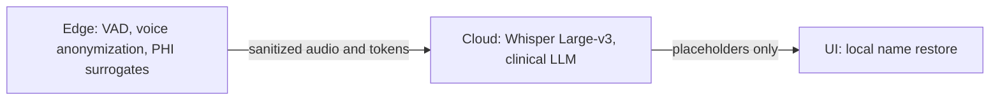
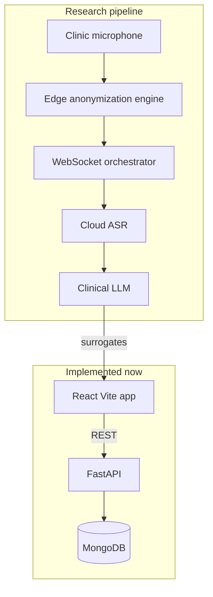

# Healthcare Audio Privacy

Privacy-preserving edge-cloud orchestration for streaming audio transcription and conversational AI in healthcare.

This repository implements a hybrid pipeline: **anonymize on the edge, transcribe and reason in the cloud, restore PHI only on the clinician device.** Raw patient audio and identifiers are not sent to multi-tenant STT or LLM APIs in recoverable form.

Full research framing, methodology, and evaluation targets: [docs/research_proposal.md](docs/research_proposal.md).

## Why this exists

Clinical voice tools need near-real-time feedback, but streaming raw audio to cloud Speech-to-Text and LLMs leaks PHI and vocal biometrics. Fully local Whisper and LLM inference on clinic hardware is too slow. The hybrid design splits the work:



**Targets** (see the proposal for how they will be measured):

| Axis | Benchmark |
| --- | --- |
| Privacy | > 25% speaker EER increase |
| Accuracy | < 8% WER on clinical audio |
| Latency | < 1,500 ms WebSocket round-trip |

## Current status

Early backend and frontend scaffold. Auth, configuration, and MongoDB wiring are in place. Streaming audio, edge anonymization, and clinical LLM orchestration are not implemented yet.

| Layer | Stack | What works today |
| --- | --- | --- |
| API | FastAPI, pydantic-settings, PyMongo, JWT | Health check, `POST /api/auth/signin` |
| Data | MongoDB Atlas (`mongodb+srv`) | Async client, user lookup |
| Frontend | React 19, TypeScript, Vite | App scaffold in `frontend/` |

## Architecture



## Repository layout

```
├── main.py                 FastAPI entrypoint
├── config.py               pydantic-settings from .env
├── db/                     MongoDB client and collections
├── features/auth/          Sign-in routes and handlers
├── middlewares/            CORS and rate limiting
├── models/                 Pydantic request/response models
├── frontend/               Clinician UI (Vite + React)
└── docs/research_proposal.md
```

## Prerequisites

- Python 3.12+
- [uv](https://docs.astral.sh/uv/)
- Node.js `^20.19.0` or `>=22.12.0` (frontend)
- MongoDB Atlas (or compatible) credentials

## Setup

### Backend

```bash
uv sync
```

Copy the keys below into a root `.env` and fill in real values.

Required environment variables:

```
ENVIRONMENT=development
APP_NAME=healthcare-audio-privacy
DB_USER=
DB_PASSWORD=
DB_HOST=
DB_NAME=
AUTH_SECRET_KEY=
AUTH_ALGORITHM=HS256
AUTH_ACCESS_TOKEN_EXPIRE_MINUTES=30
EMAIL_APP_PASSWORD=
FROM_EMAIL=
CORS_ALLOWED_ORIGINS=http://localhost:3000,http://localhost:5173
```

Start the API:

```bash
uv run uvicorn main:app --reload
```

- Health: `GET /health`
- OpenAPI (non-production): `/docs`
- Sign-in: `POST /api/auth/signin` (rate-limited to 5/minute)

### Frontend

```bash
cd frontend
pnpm install
pnpm dev
```

## Security notes

- PHI token maps must stay in edge/device RAM and be wiped when the session ends.
- Cloud responses should contain surrogate markers only (`PATIENT_01`), never original identifiers.
- Do not commit `.env`. `.gitignore` already excludes it.

## License

Research prototype. License TBD.
