# Privacy-Preserving Edge-Cloud Orchestration for Streaming Audio Transcription and Conversational AI in Healthcare

---

## 1. Executive Summary & Problem Statement

The adoption of conversational AI, voice-driven triage, and real-time medical dictation promises to dramatically reduce clinical administrative burden. However, deploying streaming voice architectures in production creates an unavoidable trade-off between **patient data privacy (HIPAA/GDPR compliance)** and **real-time processing latency**.

### Core Risks

- **Privacy risk:** Streaming raw audio containing Protected Health Information (PHI)—such as patient names, medical record numbers, and vocal identity biometrics—to external multi-tenant cloud Speech-to-Text (STT) and Large Language Model (LLM) APIs creates significant regulatory and compliance vulnerabilities.
- **Latency constraints:** Clinical voice applications (for example real-time phone intake or live doctor-patient transcription) demand sub-second or near-real-time feedback. Processing end-to-end Whisper transcription and LLM inference locally on resource-constrained clinic hardware introduces unacceptable processing bottlenecks.
- **Vocal biometric leakage:** Beyond verbal text content, raw audio carries acoustic features (pitch, timbre, cadence) that function as biometric identifiers, exposing speaker identity even if verbal names are omitted.

### Conceptual Positioning

Raw cloud streaming is fast but leaky. Fully local inference is private but slow. The hybrid edge-cloud pipeline is designed to occupy the high-privacy, low-latency quadrant.

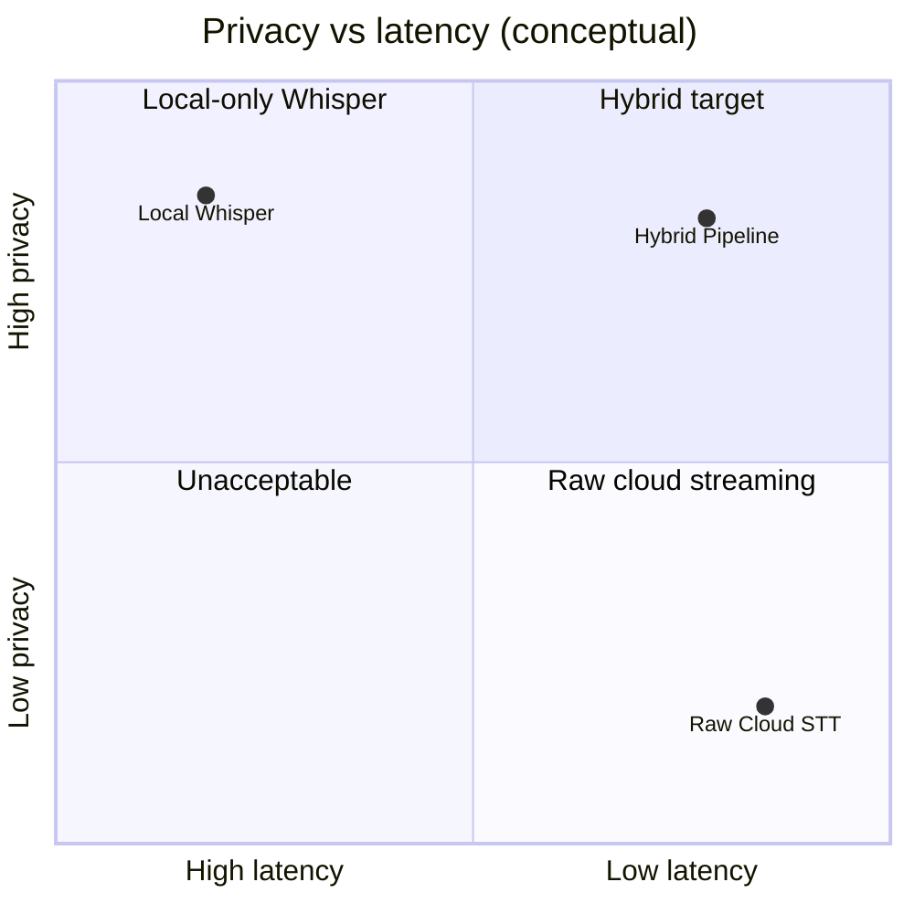

### Proposed Solution

This research proposes a **Hybrid Edge-Cloud Audio Pipeline** that decouples acoustic privacy transformation from high-accuracy speech transcription and downstream reasoning. By combining lightweight local audio feature anonymization, streaming Named Entity Recognition (NER), and token-surrogation models at the edge, raw audio is sanitized before it reaches cloud LLM inference engines.

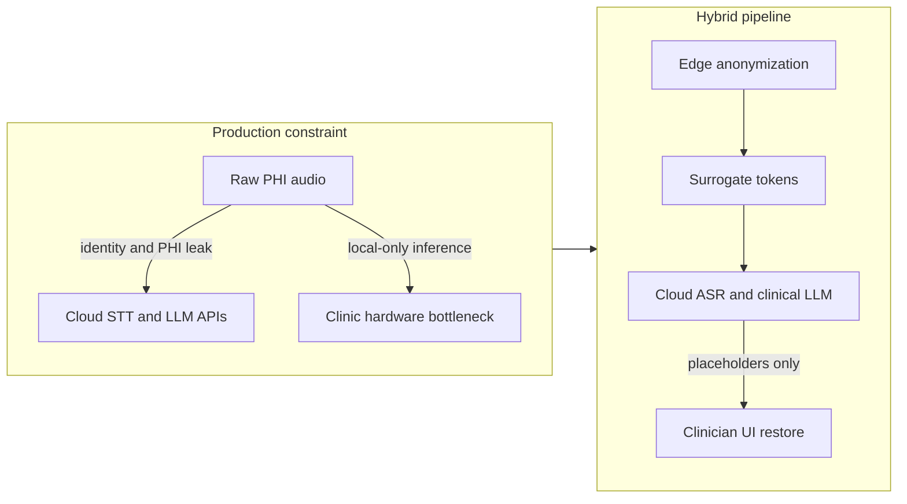

---

## 2. Research Objectives & System Architecture

### Key Research Objectives

1. **Develop an edge-assisted audio anonymization pipeline.** Design a lightweight local transformation engine that strips speaker voice biometrics (via pseudo-speaker acoustic embedding substitution) and redacts audio-based PHI prior to cloud transmission.
2. **Minimize end-to-end streaming latency.** Benchmark real-time audio chunking, WebSocket streaming, and asynchronous event-loop performance to maintain sub-1.5-second processing latency.
3. **Quantify accuracy vs. privacy trade-offs.** Systematically measure Word Error Rate (WER) and downstream LLM clinical insight extraction degradation when operating over anonymized/surrogated audio inputs versus raw audio controls.

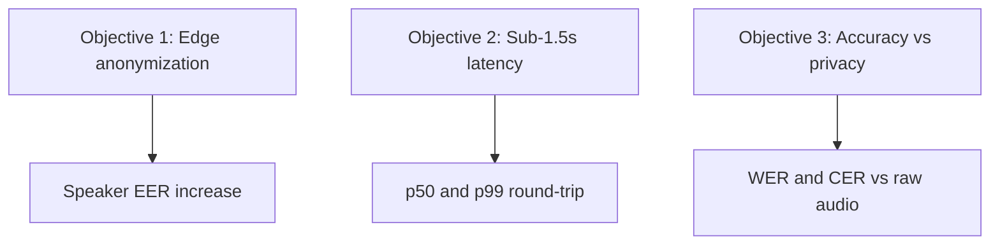

### System Architecture

PHI never leaves the clinic in recoverable form. The edge device strips voice biometrics, substitutes identifiers, and streams only anonymized audio plus surrogate tokens. Cloud services transcribe and reason over sanitized input. The clinician UI restores original names locally.

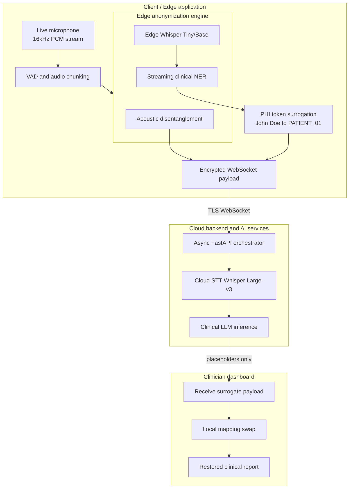

### End-to-End Sequence

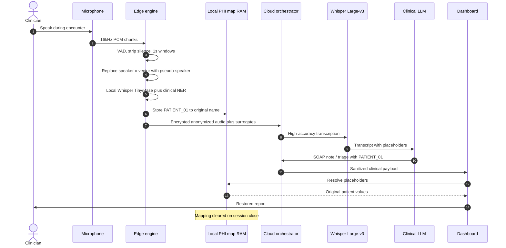

---

## 3. Detailed Methodology & Implementation Strategy

### A. Edge-Side Audio Processing & Anonymization

- **Chunking & VAD:** Incoming 16kHz mono audio streams pass through a local Voice Activity Detection (VAD) engine to strip silent segments and package audio into fixed 1-second chunks.
- **Acoustic disentanglement (voice anonymization):** To prevent biometric re-identification, the local edge engine extracts acoustic features (f0 pitch, formants) and linguistic bottleneck features using a lightweight neural acoustic model. The original speaker's x-vector identity embedding is replaced with a pseudo-speaker embedding before streaming to cloud services.
- **Local PHI token surrogation:** A lightweight local model identifies vocalized names, dates, and locations, generating a temporary local lookup dictionary (`PATIENT_01` → original name) stored exclusively in the edge device's RAM.

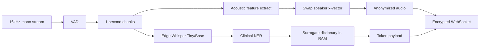

### B. High-Throughput Cloud Orchestration

- **Asynchronous backend architecture:** Build a FastAPI and WebSocket microservice pipeline deployed on containerized cloud infrastructure (Docker, AWS EC2/S3).
- **ASR & LLM workflow:** Cloud nodes process incoming anonymized audio chunks using high-capacity ASR engines (Whisper Large-v3) to generate raw text transcripts, which are then passed to clinical LLM agents (AWS Bedrock, OpenAI) for structured insight extraction, SOAP note generation, and triage categorization.

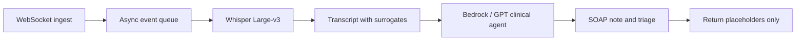

### C. Client-Side Re-identification & Security

- **Zero-trust restoration:** The cloud returns the clinical summary containing surrogate markers (`PATIENT_01`).
- **DOM-level restoration:** The clinician's authenticated frontend application receives the payload and replaces surrogates with original patient values using the local mapping table. The mapping table is cleared from memory upon session closure.

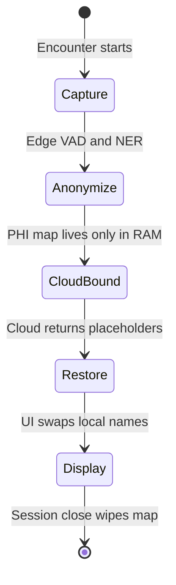

---

## 4. Evaluation & Benchmarking Metrics

The proposed system will be rigorously evaluated across three performance axes:

| Evaluation axis | Metric / tool | Target benchmark |
| --- | --- | --- |
| **Privacy & anonymization** | Equal Error Rate (EER) via Automatic Speaker Verification (ASV) | > 25% EER increase (successful speaker identity concealment) |
| **Transcription accuracy** | Word Error Rate (WER) and Concept Error Rate (CER) | < 8% WER on real-world clinical audio streams |
| **System performance** | Latency (p50, p99), throughput, RAM/CPU load | < 1,500 ms total round-trip latency over WebSockets |

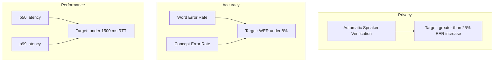

Control comparison: each metric is measured on **raw audio** versus **anonymized/surrogated audio** so privacy gains can be plotted against transcription and summarization loss.

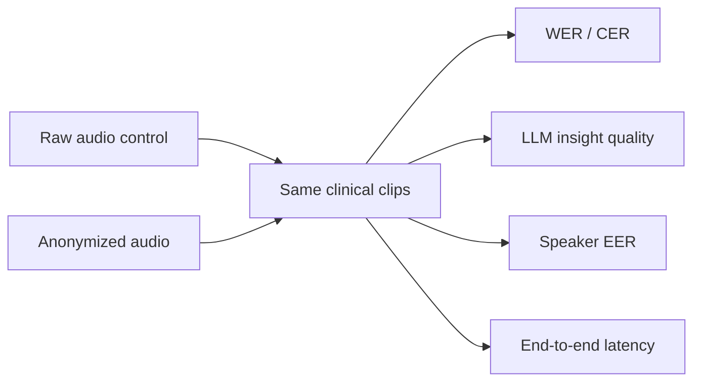

---

## 5. Expected Contributions & Future Scope

1. **System design pattern for speech AI.** Provides a reusable, open-source architectural reference for privacy-first, low-latency streaming audio processing applicable to healthcare, legal, and financial domains.
2. **Empirical trade-off dataset.** Establishes benchmark data evaluating how acoustic voice anonymization affects downstream Whisper transcription precision and LLM summarization quality.
3. **Foundation for advanced real-time systems.** Lays the groundwork for future research into on-device edge AI hardware acceleration and zero-knowledge streaming speech analytics.

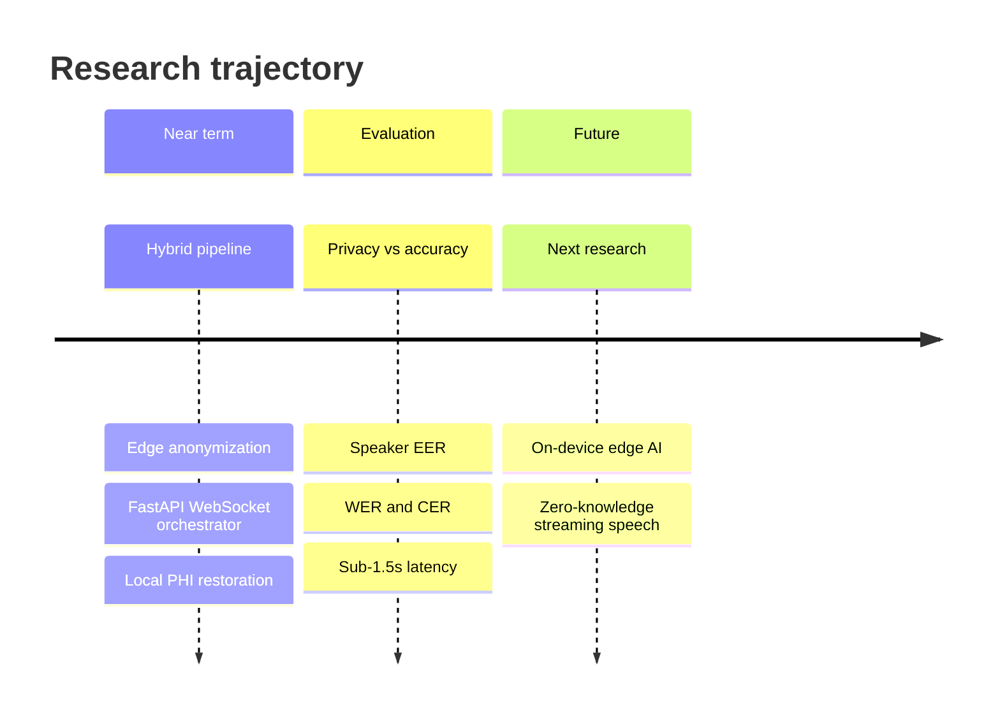
