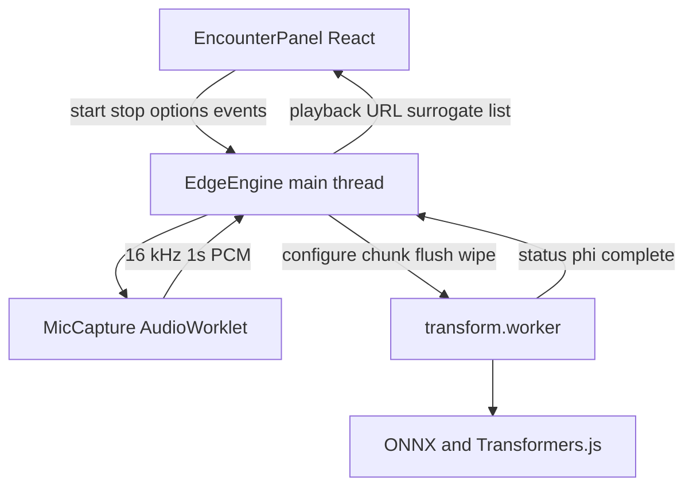
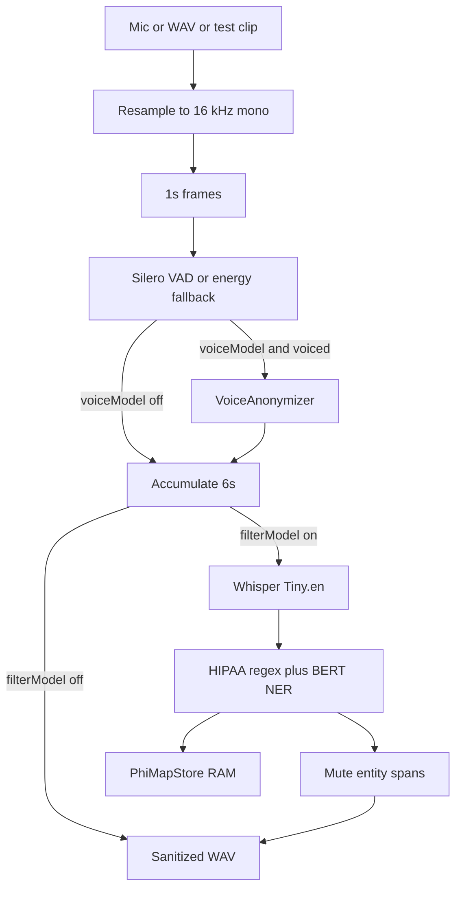

# Frontend architecture: on-device audio privacy

This document describes the **current** clinician-facing app: a browser-embedded transformation engine that sanitizes encounter audio **before** anything would be sent to the cloud. There is no WebSocket or backend audio path yet. Raw PCM and the PHI map stay in the tab.

The research target (edge anonymize → cloud ASR/LLM → local restore) is in [`docs/research_proposal.md`](../docs/research_proposal.md). This file is the implementation map of `frontend/`.

## Goal

Clinical voice leaks two things if it is streamed raw:

1. **Vocal biometrics** — pitch, formants, speaker embedding (who is speaking).
2. **Spoken PHI** — names, dates, phones, IDs, emails (what was said).

The frontend splits those into two optional stages, gated by the encounter toggles:

| Toggle | Engine flag | Effect |
| --- | --- | --- |
| Voice anonymization | `voiceModel` | Replace the live speaker with a locked pseudo-speaker via embedding-guided DSP |
| PHI filter | `filterModel` | Transcribe locally, detect identifiers, mute those spans, store `PATIENT_01 → original` in RAM |

A stage that is off is a passthrough so the same clip can be A/B’d locally.

## Layering



- **UI** ([`src/components/EncounterPanel.tsx`](src/components/EncounterPanel.tsx)) owns toggles, Start/Stop, test clip / WAV, level meter, playback, and the on-screen surrogate table. It does not run models.
- **Engine** ([`src/edge/engine.ts`](src/edge/engine.ts)) is React-independent. It captures audio, talks to one worker, and emits `EngineEvent`s.
- **Worker** ([`src/edge/workers/transform.worker.ts`](src/edge/workers/transform.worker.ts)) owns VAD, voice DSP, ASR, NER, redaction, and the RAM `PhiMapStore`. Messages are serialized on a promise chain so configure / chunk / flush / wipe cannot interleave.

Playback is **after Stop** (or after offline `processPcm`). There is no live-through output, so a few hundred milliseconds of unredacted speech cannot leak while NER is still running.

## Pipeline

Audio is always 16 kHz mono (`SAMPLE_RATE`). Capture downsamples whatever the browser gives. Processing uses 1-second chunks (`CHUNK_SECONDS`). PHI uses a 6-second window (`PHI_WINDOW_SECONDS`) because Whisper Tiny is weak on 1-second slices.



### Per 1-second chunk (worker)

1. **VAD** — Silero legacy ONNX (`1536`-sample frames). If the model fails to load, RMS energy is the fallback. Silence is kept for timeline alignment but is not anonymized.
2. **Voice** — if `voiceModel` and the chunk is voiced, `VoiceAnonymizer.anonymize` runs. Otherwise the PCM is unchanged.
3. **PHI buffer** — if `filterModel`, the (possibly anonymized) chunk is appended. When pending samples reach 6 seconds, the window is transcribed, entities are detected, those time spans are zeroed (short 880 Hz beep), and the map is posted to the UI.
4. **Flush on Stop** — remaining PHI buffer is processed the same way, then the concatenated output is transferred back as `Float32Array`.

Mid-session toggle changes apply from the **next chunk**. They do not remount the engine.

## Voice anonymization (biometric strip)

This is embedding-guided DSP, not a neural vocoder.

1. Collect about 2 seconds of voiced audio (`EMBED_LOCK_SECONDS`).
2. Extract a speaker embedding:
   - Preferred: WeSpeaker **ECAPA-TDNN 512** ONNX at `/models/ecapa-tdnn.onnx` via `onnxruntime-web`.
   - Fallback: 192-d MFCC statistical embedding if the ONNX file is missing or inference fails.
3. Compare cosine distance against a bank of 12 precomputed pseudo-speakers ([`pseudoSpeakerBank.ts`](src/edge/voice/pseudoSpeakerBank.ts)).
4. **Lock** the farthest speaker for the rest of the encounter (stable voice).
5. Realize the swap with DSP ([`mcadams.ts`](src/edge/voice/mcadams.ts)):
   - McAdams LPC pole-angle shift (spectral-warp fallback if a frame is unstable)
   - Formant frequency warp
   - F0 shift in semitones
   - Hard clip to `[-0.98, 0.98]`

Until lock, a default DSP preset is applied so early chunks are still transformed.

`anonymize(chunk) → pcm` is the only voice interface. A vocoder can replace the waveform stage later without changing the worker.

## PHI redaction (spoken identifiers)

1. **ASR** — `Xenova/whisper-tiny.en` (q8) through `@huggingface/transformers`, with word timestamps.
2. **Detection** — HIPAA Safe Harbor regex (phones, emails, SSN/MRN-like IDs, month dates, years) plus `Xenova/bert-base-NER` for PERSON / LOC / ORG. Regex always runs; NER is skipped if the model fails to load.
3. **Alignment** — entity strings are matched to word timestamps; 50 ms pad on each side.
4. **Audio** — those samples are muted; a short beep marks the hole.
5. **Map** — [`PhiMapStore`](src/edge/phi/phiMap.ts) assigns session-stable surrogates (`PATIENT_01`, `DATE_01`, `PHONE_01`, …) with coreference on normalized text. The store is a module-level `Map` in the worker. It is never written to `localStorage`.

The clinician UI shows the map only as a RAM snapshot. `wipe()` clears the worker store on Stop, Wipe session, tab hide, and unmount.

## Models and load policy

Weights are not committed.

| Model | Where | When loaded |
| --- | --- | --- |
| Silero VAD legacy | CDN ONNX + `onnxruntime-web` | Every session start |
| ECAPA-TDNN | `public/models/ecapa-tdnn.onnx` (`pnpm fetch-models`) | First time `voiceModel` is on |
| Whisper Tiny.en q8 | Hugging Face Hub → Cache API | First time `filterModel` is on |
| BERT-base NER q8 | Hugging Face Hub → Cache API | First time `filterModel` is on |

A voice-only session never downloads Whisper or NER. ONNX Runtime is pinned to **one WASM thread** so SharedArrayBuffer / COOP-COEP is not required.

## Module map

```
src/
  App.tsx                         Thin shell → EncounterPanel
  components/EncounterPanel.tsx   Clinician demo UI
  edge/
    engine.ts                     Main-thread facade
    types.ts                      Chunks, options, events, worker protocol
    capture/mic.ts                getUserMedia + AudioWorklet PCM tap
    vad/vad.ts                    Silero ONNX + energy fallback
    voice/embedding.ts            ECAPA or MFCC
    voice/pseudoSpeakerBank.ts    12 DSP presets + unit embeddings
    voice/mcadams.ts              LPC McAdams, F0, formant warp
    voice/anonymizer.ts           Session lock
    phi/asr.ts                    Whisper Tiny
    phi/ner.ts                    Regex + NER
    phi/redact.ts                 Span mute
    phi/phiMap.ts                 RAM surrogates
    audio/                        Resample, WAV, fbank, test-clip synth
    workers/transform.worker.ts   All inference
```

## Privacy rules (implemented)

- Raw microphone buffers never leave the tab. There is no upload client.
- The only artifact the UI can keep after Stop is a **sanitized WAV** (object URL) plus an in-memory surrogate list.
- `PhiMapStore.wipe()` runs on encounter reset, tab hide, and engine dispose.
- Worker errors surface as `EngineEvent` `error`; they do not persist PHI.

## Out of scope today

These are in the research proposal but **not** in this frontend:

- FastAPI / TLS WebSocket ingest
- Cloud Whisper Large-v3 and clinical LLM
- DOM restore of `PATIENT_01` inside a cloud-returned note
- Speaker EER / WER evaluation harness
- Neural vocoder identity swap

The engine’s event surface (`complete`, `phi`, `status`) is the intended attach point for a future sanitized-stream client.